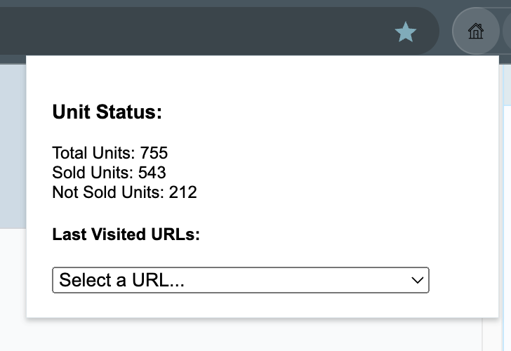
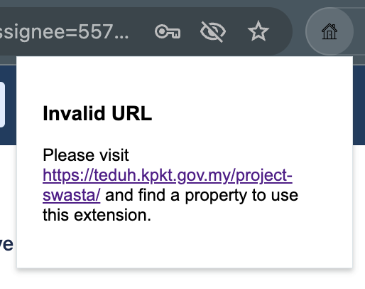

# teduh-unit-counter
Google Chrome extension - Counts units with 'Telah Dijual' status on the page.

### Development

To install in your chrome extension locally, you need to enable Developer Mode.

  #### Load the Extension in Chrome

  1.	Open Chrome and go to chrome://extensions/.
  2.	Enable Developer mode (toggle switch in the top right).
  3.	Click Load unpacked and select the folder you created.
  4.	The extension will now appear in your extensions toolbar.

### Demo

#### Showing Unit Status

When you open up the plugin in Teduh `Senarai Unit Perumahan Swasta` page, you'll see it in action.

#### Incorrect URL detected

Show URL for quick redirection
